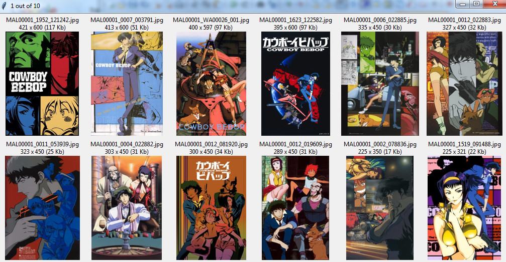

A gathered, cleaned and partially labeled dataset of 135786 faces on 45286 anime posters scraped from [MyAnimeList](https://myanimelist.net) and [World Art](http://www.world-art.ru/animation), intended for training and evaluation of stylized face detectors. Also included are minimalistic GUI tools for labeling and near-duplicate removal in Tkinter, as well as all scripts used during the gathering process.

The closest publicly available things, to my knowledge, are [iCartoonFace](https://github.com/luxiangju-PersonAI/iCartoonFace) and [VOC2007 anime face detector dataset](https://github.com/qhgz2013/anime-face-detector#dataset), but those have only a couple of faces per image on average, while posters can easily go up to 10-15, potentially leading to more efficient training and stronger resulting models.

### Table of Contents
- [Dataset](#dataset)
  - [Structure](#structure)
  - [Labels](#labels)
  - [Process](#process)
- [Tools](#tools)
  - [Labeler](#labeler)
  - [Comparer](#comparer)
  - [Explorer](#explorer)
- [Acknowledgements](#acknowledgements)
- [Future Plans](#future-plans)

## Dataset
**Download link** (4 GB): https://drive.google.com/open?id=1QihyiffvoBA0Q55UEXsAKG5I5LZ3ZJle

*Content warning:* all MAL entries with "Rx - Hentai" rating were excluded, but not with "R+ - Mild Nudity", so a small amount of NSFW images might be present. Borderline entries with tags like "ecchi" were not removed, so a somewhat larger subset of images may be considered suggestive or sexualized depending on the person.

### Structure
File naming pattern: `MAL<ID>_<N1>_<N2>.jpg` or `MAL<ID>_WA<ID2>_<N3>.jpg`, where
- `ID` is the anime ID on MyAnimeList (zero-padded to 6 symbols).<br/>
You can use it to go to the anime page: `myanimelist.net/anime/<ID>`
- `N1` and `N2` are MAL internal numbers for this particular image (zero-padded to 4 and 6 symbols respectively).<br/>
You can restore a direct link like (remove leading zeros): `cdn.myanimelist.net/images/anime/<N1>/<N2>l.jpg`, e.g.<br/>
MAL00005_1018_120197.jpg -> https://cdn.myanimelist.net/images/anime/1018/120197l.jpg</br>
MAL00801_0009_034259.jpg -> https://cdn.myanimelist.net/images/anime/9/34259l.jpg</br>
(Note that this won't always work since some images might've been moved or deleted since the gathering)</br>
- `ID2` is the anime ID on World Art (zero-padded to 5 symbols), meaning that this particular image is from there instead of MAL (thr reason is usually a higher resolution/quality).<br/>
You can use it to go to the anime page: `world-art.ru/animation/animation.php?id=<ID2>`
- `N3` is the image ID on World Art (zero-padded to 3 symbols). You can get the poster URL like this: `world-art.ru/animation/animation_poster.php?id=<ID2>&number_img=<N3>`, e.g. MAL00020_WA00262_164.jpg -> http://www.world-art.ru/animation/animation_poster.php?id=262&number_img=164

The images are divided into 10 subfolders based on their MAL IDs: "0" - 1 to 999, "1" - 1000 to 2499, "2" - 2500 to 4999, "3" - 5000 to 9999, "4" - 10000 to 19999, "5" - 20000 to 31999, "6" - 32000 to 37999, "7" - 38000 to 43999, "8" - 44000 to 49999, "9" - 50000 to 54449.

### Labels
The general structure of a label file is: `<subfolder>\<filename>.jpg: X1 Y1 X2 Y2 CLS[, X1 Y1 X2 Y2 CLS, ...]`, i.e. one line per image with comma-separated bounding boxes (top-left, then bottom-right corner coordinates) plus a class index if present.
- `labels_faces.txt` lists the labels for the first 5000 images of the dataset, with the starting 2000 of them being manually refined and classified.
- `labels_faces_baseline.txt` containts the baseline labels for all 45286 images obtained automatically using Faster-RCNN [Anime Face Detector](https://github.com/hysts/anime-face-detector) by **hysts**. The 5th number here is a detection score instead of a class index.
- `classes.txt` lists 15 face classes: boy, girl, young man, young woman, animal, fantasy creature, etc.
- `delcands.txt` has image indices currently marked for deletion (useful only if you'll be using the provided GUI labeler).
- `labels_heads.txt` contains the bounding boxes for full heads instead of faces for the first 5000 images, with the starting ~200 of them being manually refined.
- `labels_heads_baseline_10000.txt` contains the baseline head labels for the first 10000 images obtained automatically using [AnimeHeadDetector](https://github.com/grapeot/AnimeHeadDetector) by **grapeot**.

### Process
[MyAnimeList](https://myanimelist.net) most likely needs no introduction; [World Art](http://www.world-art.ru/animation) is its old but very carefully maintained Russian analog that generally has less posters per anime but with a higher resolution or quality. The majority of World Art anime pages also have a MAL link for the same title, making it easy to match the IDs from both sites and merge the scraped images together (see `scrape.py` functions for more details).

However, this also led to a lot of repetition, so a pretty extensive cleaning process was performed, mixing both manual and automated approaches, leading to a total of 28866 near-duplicates being removed:
1) For every same-anime pair with an [average hash](https://hackerfactor.com/blog/index.php%3F/archives/432-Looks-Like-It.html) difference of 0 to 2, a smaller image was removed immediately.
2) For every same-anime pair with a difference of 3 to 14, the same was done but selectively after a manual inspection using `gui_comparer.py` (with higher numbers naturally leading to much more false positives but still catching some good candidates).
3) For everything that's remained, the same as above was done using pHash (perceptual hash) <=4  and dHash (difference hash) <=16 (both seemed significantly more random than aHash for this particular use case but still helped a bit).
4) A manual inspection per anime (that had more than 1 image) using `gui_explorer.py` was done, leading to quite a lot of additional catches.
5) Steps 1-3 were repeated but now on the whole dataset, i.e. for the pairs from different anime (but with smaller max differences, since this is where hashes were really starting to show their limits).
6) Step 5 was repeated but now with embeddings obtained from a pretrained ViT-L16 classifier (courtesy of [Animesion](https://github.com/arkel23/animesion) by **arkel23**). Up to the [cosine distance](https://scikit-learn.org/stable/modules/generated/sklearn.metrics.pairwise.cosine_distances.html) of 0.2, the accuracy improvement compared to the hashes was huge, and it was selectively catching duplicates up to around 0.32.

In addition (see `updown.py` functions):
1) All very large images (379 files) were downscaled to fit into a 1920px square and saved with a JPG quality of 75.
2) All images heavier than 700 Kb (678 files) were resaved with a JPG quality of 80.
3) All images with both dimensions <300px (2035 files) were upscaled using [Real-ESRGAN](https://github.com/xinntao/Real-ESRGAN) by **xinntao**. This one is kinda questionable, since a "bold" neural net upscaler like that, when applied to very small images, starts to hallucinate details, which led to some pretty weird faces, but I thought that it won't be detrimental to the task of detection (perhaps even beneficial, as a little extra generalization-inducing hurdle) and will definitely be helpful for the manual labeling (compared to trying to discern something in a 10x10px region). This also felt like a necessary step since older MAL entries have quite a lot of tiny images.

Note that the scraping was last run on 12 Feb 2023, so quite a lot of new stuff must've appeared since then (especially on MAL), but in terms of data distribution or training potential I think it's unlikely to make a noticeable difference.

## Tools
### Labeler

`gui_labeler.py` lets you draw bounding boxes with the mouse, adjust them (also with the mouse by dragging the corners or more finely with keyboard keys), change their color for visibility, assign classes by pressing 0-9, browse/step through the files quickly and scale + pan an image at will. This is no replacement for the established annotation solutions like [CVAT](https://www.cvat.ai), but it's lightweight, cross-platform and does the job just fine for this particular task.

```python
from tools.gui_labeler import LabelerGUI
from scripts.utils import list_files
root_dir = '<absolute path to LAP/anime or other dir with images>'
files = list_files(root_dir)[:5000]
gui = LabelerGUI()
gui.init_data(root_dir, files)
gui.run()
```

The above will create new `bboxes.txt` and `delcands.txt` files at `root_dir` (the latter is for saving indices of images that you mark as removal candidates, which might be helpful if you realize that an image is no longer needed). The labeler will autosave all progress to these .txt files when you close it. Limiting the file count with something like `[:5000]` is not necessary but could help with faster loading times (you probably won't need to work with more than that at a time anyway).

To continue, you can also specify existing files and a starting point, as well as use the `backup` flag to automatically make a copy of both .txt files on startup named `<basename>_YYYYMMDD_TTMM.txt`:
```python
gui.init_data(root_dir, files, 'labels_faces.txt', 'delcands.txt', backup=True, start=500)
```

Another possible use case is to explore the [WIDER FACE](http://shuoyang1213.me/WIDERFACE) dataset, which works as a great example/benchmark from the more well-researched world of IRL faces. You can use `wider.py` to convert their labels into the local format, then launch it the same way with `readonly=True`, preventing any modification to the .txt files.

### Comparer

`gui_comparer.py` displays pairs of images side-by-side along with their size in pixels and Kb, letting you quickly browse through automatically selected duplicate candidates to confirm their validity. This corresponds to steps 2-3 of the cleaning process (as described above) and can be used through a helper function like so:

```python
from scripts.utils import list_files
from scripts.clean import remove_duplicates
root_dir = '<absolute path to LAP/anime or other dir with images>'
files = list_files(root_dir)[:100]
sel, cand = remove_duplicates(root_dir, files, None, 'total', 'ahash', 'hamming', rang=32)
for s in zip(sel):
    print(s)
```

The above will calculate average hash differences for the first 100 images and show every pair with <=32 in the ascending order. Press `r` to reject, `Space` to confirm (the right image will be marked), `s` to swap (the left image will be marked), `Backspace` to step back or `Shift-E` to abort. In the end, `sel` will contain the names of all confirmed duplicates.

You can change `None` to some `files2` enumeration to compare two lists of files to each other (instead of one list to itself) or replace `total` with `group` to only do comparisons within the same anime (i.e. the same `MAL<ID>_` prefix). You can also change `ahash` to `phash`, `dhash` or `vit` (the latter + `cosine` instead of `hamming` can replicate step 6 of the cleaning process).

### Explorer

`gui_explorer.py` shows images grouped by the same MAL ID, letting you examine them and mark some for deletion (or any other future processing) if needed. This corresponds to step 4 of the cleaning and can be used through a helper function like so:

```python
from scripts.clean import browse_groups
root_dir = '<absolute path to LAP/anime or other dir with images>'
sel = browse_groups(root_dir, stop=10)
for s in sel:
    print(s)
```

The above will display images for the first 10 anime entries. Use `Space`, `Backspace` or mouse wheel to navigate and mouse click or `0-9` keys to mark an image (its name will become highlighted in red). You can also use arrow keys to scale the window. In the end, `sel` will contain the paths (relative to `root_dir`) of every marked image.

## Acknowledgements
Big thanks to both the MAL and WA teams for not blocking requests based on a user agent, obscuring their DOM or showing any other signs of trying to make a data gatherer's life more complicated. In the past I've had a brief outing with trying to scrape from the "big guys" (YouTube/Twitter), and this is so straightforward and pleasant in comparison that it almost feels illegal.

## Future Plans
Initially I was hoping to turn this into a much more finished project, getting more boxes manually refined/classified, training improved detection models for a better automated pass, as well as expanding the dataset with cartoon posters (hence the word "animation" instead of "anime" in the title). But after adjusting my expectations to the reality of the manual labeling's time requirements and mental fatigue, I think I'm fine with leaving it at the current stage.

However, if you happen to stumble upon this repo and find it potentially useful yet lacking in terms of completion, please do leave a message, as this will likely make me motivated to put more work into at least some of the things highlighted above.